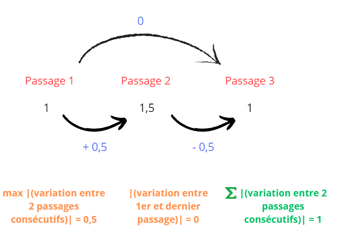

```{r setup, include=FALSE}
knitr::opts_chunk$set(echo = TRUE, warning=FALSE, message=FALSE)
```

Le but de ce document est de préparer les données à utiliser pour le volet 2 de l'étude "évaluation de l'état hydromorphologique des cours d'eau de Hauts-de-France". Ce volet a pour objectif de se concentrer sur les liens entre hydromorphologie et pressions anthropiques à l'endroit de stations Carhyce pour lesquelles une évolution notable de l'état hydromorphologique est constatée. 

La mise en forme des données nécessaires au volet 2 comprend la sélection des stations à étudier et la construction des data frames de données relatives à ces stations. 

```{r}
#chargement library necessaires 

if (!require(pacman)) install.packages("pacman") 

pacman::p_load(tidyverse, openxlsx, ggpubr) # installe les packages non installés et charge tout

```

```{r}
#importation des data frame de travail de base contenant les résultats de toutes les opérations Carhyce 

load(file="raw_data/carhyce_hdf_ofb.RData") 

```

# I) Selection des stations à étudier 

## 1) Pré-sélection sur la base des variations d'IMG 

En accord avec le COPIL (16-10-2023), les stations à étudier pour ce volet 2 seront celles dont on peu constater une évolution notable de l'IMG (indicateur relatif à l'état global de la géométrie hydraulique par rapport à une situation de référence) entre les différents passages Carhyce. 

Cette selection ne concerne donc que les stations ayant été prospectées au moins deux fois. 

```{r}
#selection des stations avec au moins deux passages 

carhyce_hdf_varIMG<-carhyce_hdf_ofb %>% 
  dplyr::group_by(Libelle_sta, Code_sta) %>% 
  filter(n()>=2) %>% 
  select(Id_ope:Date, Cours_eau, Version_protocole, Nom_HER_dominant, IMG, Classe_IMG)

```

Il s'agit de calculer une variation d'IMG entre les différents passages pour chaque station. Elle consistera simplement en la différence (en valeur absolue) d'IMG entre un passage et le passage précédent. Dans le cas où la station ne présente que deux passages, la variation correspondra à la différence entre les deux passages. Dans le cas où la station présente trois passages, seule la variation la plus élevée entre deux passages consécutifs sera conservée. 

On considérera que la variation d'IMG justifiera la sélection de la station si la variation est **>= à 1,5**. Ceci en se basant sur l'intervalle séparant deux classes de qualité de l'IMG (cf. IED Carhyce).  

```{r}
# calcul pour chaque station de la variation d'IMG et sélection des stations avec une variation >=1,5

carhyce_hdf_varIMG<-carhyce_hdf_varIMG %>% 
  dplyr::group_by(Libelle_sta, Code_sta) %>% 
  arrange(Date) %>% 
  dplyr::reframe(var=abs(diff(IMG))) 

carhyce_hdf_varIMGmax<-carhyce_hdf_varIMG %>% 
  dplyr:: group_by(Libelle_sta, Code_sta) %>% 
  filter(var==max(var)) %>% 
  ungroup() %>% 
  filter(var>=1.5)
```

Les stations à sélectionner (dont l'IMG varie de plus de 1,5 entre deux passages successifs) sont : 

```{r}
carhyce_hdf_varIMGmax$Libelle_sta
```

```{r}
#création d'un vecteur de codes stations à étudier pour le volet 2 : 

stations_etape2<-carhyce_hdf_varIMG$Code_sta 

```

## 2) Pré-sélection sur la base des variations des métriques étudiées en volet 1 

```{r}
load(file="processed_data/1_debit_plein_bord_Q2.RData")
```

En accord avec le deuxième COPIL (20-11-2023), la pré-selection des stations se fera finalement sur la base de la variation de l'IMG et de chacune des métriques étudiées en volet 1 de l'étude, excepté le rapport largeur/profondeur de plein bord déjà inclus dans l'IMG. Autrement dit : 

- La puissance spécifique de plein bord
- Le rapport du débit de plein bord sur le débit de crue biennale (Qb_Q2) 
- Le score ripisylve 
- Le % de sédiments fins 
- Le coefficient de sinuosité 

La sélection définitive des stations (entre 5 et 10 stations au maximum) se fera en comparant l'évolution des métriques avec les pressions anthropiques afin de sélectionner des stations aux situations variées. 

Il s'agit dans un premier temps de déterminer à partir de quelle valeur de variation il est considéré que l'évolution de la métrique étudiée est "notable". Celle-ci est en majorité déterminée à partir des plus petit intervalles entre deux classes de qualité de la métrique étudiée (cf. volet 1 de l'étude). Pour la métrique Qb_Q2 qui ne présente que deux classes de qualité (Bon et Mauvais), la détermination de la variation notable est plus subjective. Elle sera fixée en fonction de la variation qui amènerait une station en bon état à n'être plus en bon état de façon nette (on considère par exemple qu'il peut être intéressant de parfois légèrement sur-dimensionner un cours d'eau => Qb_Q2 légèrement >1). 

Ces variations notables sont : 

- L'IMG : >= 1,5 
- La puissance spécifique de plein bord : >= 15 W/m^2 
- Qb_Q2 : >= 0,4 
- Le score ripisylve : >= 0,3 
- %fines : >= 15 % 
- Coefficient de sinuosité : >=0,05 

```{r}
#selection des stations à étudier (celles avec au moins deux passages)

#selection des stations avec au moins deux passages 

carhyce_hdf_var<-carhyce_hdf_ofb %>% 
  dplyr::group_by(Libelle_sta, Code_sta) %>% 
  filter(n()>=2) %>% 
  select(Id_ope:Date, Cours_eau, Version_protocole, Nom_HER_dominant, 
         IMG, Classe_IMG, 
         Puissance_spe_Qb,
         Score_ripisylve,
         X._fines,
         Coef_sinuosite)
```

```{r}
#jointure des données de Qb_Q2 (par les id opération)

carhyce_hdf_var<-left_join(carhyce_hdf_var, hydro_carhyce_vf, by="Id_ope")

carhyce_hdf_var<-carhyce_hdf_var %>% 
  select(Id_ope, libelle_sta, Code_sta:Id_pt, Date=Date.x, Cours_eau:Coef_sinuosite, Qb_Q2)

```

L'identification d'une "variation notable de l'état hydromorphologique" se fera par le biais de la création d'une colonne par métrique étudiée, contenant soit 1 (variation notable) soit 0 (pas de variation notable). Seront pré-sélectionnées les stations ayant le plus grand nombre de 1 (de façon à avoir au moins 10 stations pré-sélectionnées pour pouvoir ensuite croiser avec les pressions).

Les variations seront calculées uniquement entre les deux premières opérations pour les stations ayant été prospectées trois fois.   

```{r}
#separation des stations à 2 et 3 opérations : 

ope2<-carhyce_hdf_var %>% 
  filter(n()==2)

ope3<-carhyce_hdf_var %>% 
  filter(n()==3)

# pour les stations à 3 opérations, ne conserver que les deux premières : 

ope3<-ope3 %>% 
  filter(Date != max(Date))

carhyce_hdf_var<-rbind(ope2, ope3)
```


```{r}
carhyce_hdf_var<-carhyce_hdf_var %>% 
  dplyr::group_by(libelle_sta, Code_sta) %>% 
  dplyr::reframe(var_IMG=abs(diff(IMG)),
                 var_puissance=abs(diff(Puissance_spe_Qb)),
                 var_Qb_Q2=sum(abs(diff(Qb_Q2))),
                 var_ripisylve=abs(diff(Score_ripisylve)),
                 var_fines=abs(diff(X._fines)),
                 var_sinuosite=abs(diff(Coef_sinuosite))) 
 
```


```{r}
carhyce_hdf_var<-carhyce_hdf_var %>% 
  mutate(var_IMG_disc= case_when(
    var_IMG >= 1.5 ~ 1,
    var_IMG < 1.5 ~ 0),
    
    var_puissance_disc = case_when(
      var_puissance>=15 ~ 1,
      var_puissance<15 ~ 0),
    
    var_Qb_Q2_disc = case_when(
       var_Qb_Q2 >=0.2 ~ 1,  
       var_Qb_Q2 <0.2 ~ 0),
    
    var_ripisylve_disc = case_when(
      var_ripisylve>=0.3 ~ 1,
      var_ripisylve<0.3 ~ 0),
    
    var_fines_disc = case_when(
      var_fines>=15 ~ 1,
      var_fines<15 ~ 0),
    
    var_sinuosite_disc = case_when(
      var_sinuosite>=0.05 ~ 1,
      var_sinuosite<0.05 ~ 0)
    )
```

```{r}
carhyce_hdf_var<-carhyce_hdf_var %>% 
  mutate(sum_var= select(.,var_IMG_disc:var_sinuosite_disc) 
         %>% rowSums(na.rm=T))
                    
```

Le maximum de métriques évoluant notablement entre les deux premiers passages Carhyce est de 3. Les stations pour lesquelles 3 métriques évoluent notablement sont : 

```{r}
carhyce_hdf_var %>% 
  filter(sum_var==3) %>% 
  select(libelle_sta)
```

# Annexes : testé mais non retenu 

L'identification d'une "variation notable de l'état hydromorphologique" se fera par le biais de la création d'une colonne par métrique étudiée, contenant soit 1 (variation notable) soit 0 (pas de variation notable). Seront pré-sélectionnées les stations ayant le plus grand nombre de 1 (de façon à avoir au moins 10 stations pré-selectionnées pour pouvoir ensuite croiser avec les pressions).

Les variations ne seront pas calculées entre deux passages consécutifs comme en Partie I)1) ni entre la première et la dernière opération. En effet,ces deux méthodes de calcul ne semblent pas pouvoir donner une image fidèle des variations d'état hydromorphologique survenant au niveau d'une station : 

- le calcul du maximum de différence de métrique (en valeur absolue) entre deux passages n'est représentatif que d'une partie de la variation d'hydromorphologique dans le cas où la stations a été prospectée plus de deux fois. 
- la différence de métrique entre le premier et le dernier passage peut être nulle alors même que la métrique a varié entre les passages, si la première et la dernière valeur sont égales. 

Attention : cette méthode, bien que plus représentative des variations de métriques au niveau des stations, est également plus sensible aux possibles biais opérateurs




```{r}
#selection des stations à étudier (celles avec au moins deux passages)

#selection des stations avec au moins deux passages 

carhyce_hdf_var2<-carhyce_hdf_ofb %>% 
  dplyr::group_by(Libelle_sta, Code_sta) %>% 
  filter(n()>=2) %>% 
  select(Id_ope:Date, Cours_eau, Version_protocole, Nom_HER_dominant, 
         IMG, Classe_IMG, 
         Puissance_spe_Qb,
         Score_ripisylve,
         X._fines,
         Coef_sinuosite)
```

```{r}
#jointure des données de Qb_Q2 (par les id opération)

carhyce_hdf_var2<-left_join(carhyce_hdf_var2, hydro_carhyce_vf, by="Id_ope")

carhyce_hdf_var2<-carhyce_hdf_var2 %>% 
  select(Id_ope, libelle_sta, Code_sta:Id_pt, Date=Date.x, Cours_eau:Coef_sinuosite, Qb_Q2)

```


```{r}
carhyce_hdf_var2<-carhyce_hdf_var2 %>% 
  dplyr::group_by(libelle_sta, Code_sta) %>% 
  arrange(Date) %>% 
  dplyr::reframe(var_IMG=sum(abs(diff(IMG))),
                 var_puissance=sum(abs(diff(Puissance_spe_Qb))),
                 var_Qb_Q2=sum(abs(diff(Qb_Q2))),
                 var_ripisylve=sum(abs(diff(Score_ripisylve))),
                 var_fines=sum(abs(diff(X._fines))),
                 var_sinuosite=sum(abs(diff(Coef_sinuosite)))) 
 
```


```{r}
carhyce_hdf_var2<-carhyce_hdf_var2 %>% 
  mutate(var_IMG_disc= case_when(
    var_IMG >= 1.5 ~ 1,
    var_IMG < 1.5 ~ 0),
    
    var_puissance_disc = case_when(
      var_puissance>=15 ~ 1,
      var_puissance<15 ~ 0),
    
    var_Qb_Q2_disc = case_when(
       var_Qb_Q2 >=0.2 ~ 1,  
       var_Qb_Q2 <0.2 ~ 0),
    
    var_ripisylve_disc = case_when(
      var_ripisylve>=0.3 ~ 1,
      var_ripisylve<0.3 ~ 0),
    
    var_fines_disc = case_when(
      var_fines>=15 ~ 1,
      var_fines<15 ~ 0),
    
    var_sinuosite_disc = case_when(
      var_sinuosite>=0.05 ~ 1,
      var_sinuosite<0.05 ~ 0)
    )
```

```{r}
carhyce_hdf_var2<-carhyce_hdf_var2 %>% 
  mutate(sum_var= select(.,var_IMG_disc:var_sinuosite_disc) 
         %>% rowSums(na.rm=T))
                    
```


